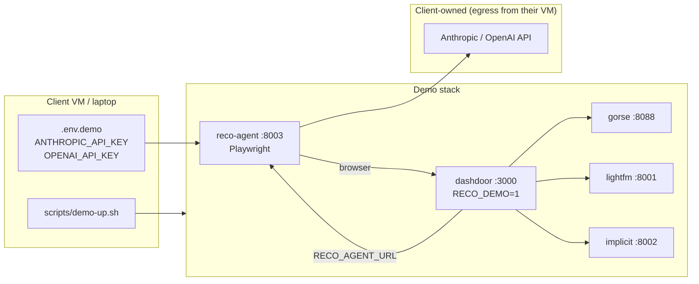

# Demo setup — client self-serve on the real gym

Demo experience that runs the **full Dashdoor gym** (real UI, real DB, real
verifier events), lets clients pick an engine or an LLM agent on the same
scoreboard, and **brings their own API keys** without us in the room.

Product shape: **`/demo` = short landing page** (what this is + where to
go). The home gym (`/home`) stays the main app; an unobtrusive header
link on `/home` points eval users to that landing. Same Next.js build,
gated by `RECO_DEMO=1`.

Anything ambitious (preset profiles, status API, dedicated agent
kickoff page, replay scrubber, enterprise LLM gateway, compare wizard,
task upload, run queueing) lives in `future_ideas.md`. v1 is the
minimum that lets a client see an agent get a real `Hit@K` row next to
the engine track on one demo task.

---

## Goals

| Goal | Meaning |
|------|---------|
| **Real gym** | Agent drives the same `/home`, `/store`, checkout surfaces humans use — not a mock. |
| **Demo-only surface** | Reco pages and controls appear only when `RECO_DEMO=1`; normal gym stays unchanged. |
| **BYO LLM** | Client supplies `ANTHROPIC_API_KEY` and/or `OPENAI_API_KEY` on *their* VM. We never host their keys. |
| **Self-drive** | One compose file, one script, one landing page — no repo archaeology. |
| **Fair comparison** | Same task, same metrics, engine row next to agent row on one scoreboard. |

Non-goals for v1: multi-tenant SaaS, custom task authoring, replay UI,
running the client's model weights on our GPUs.

---

## Three demo modes (client-facing)

`/demo` lists three plain link cards. No live status, no embedded eval
UI — each card just routes to an existing surface.

### Mode 1 — Engine lab
- **Where:** `/reco-eval`
- **What:** Multi-select engines (`random`, `popularity`, `gorse`,
  `lightfm`, `implicit`, plus `agent` when sidecar up), pick task set
  (`seed` / `history`), Run.
- **Why:** Engine plug-in contract + metric board in &lt; 1 min.

### Mode 2 — Agent lab
- **Where:** `/reco-eval` with `agent` row selected (no separate kickoff
  page — the agent is just another engine in the registry once
  `RECO_AGENT_URL` is set).
- **What:** Same Hit@K / NDCG / MRR row, computed by mapping the agent's
  trajectory through `lib/reco/agent/extract.ts`. Per-run config
  (`model`, `maxSteps`) lives on the **sidecar's env**, not the UI —
  one less form to misconfigure.
- **Why:** Same metrics as libraries, but the recommendation = what the
  model *did* in the browser.

### Mode 3 — Live re-rank
- **Where:** `/home` + header **Reco** picker (already shipped in
  Phase 3).
- **What:** Toggle engine in the picker — grid re-orders, status pill
  shows `re-ranked by {engine}`.
- **Why:** Connects offline scores to something a PM can *see*.

---

## Architecture



**Rule:** Dashdoor never calls the LLM unless the agent sidecar is
running on the client's infra with **their** keys.

---

## Pre-auth via localStorage seeding (biggest reliability win)

The Phase 4 sign-in dance (modal → email → "Use password" → password →
submit → dismiss promo modals) is fragile: backdrops intercept clicks,
Sonnet sometimes picks the wrong selector, and our test shows ~70–80%
first-try success. For a client demo this isn't good enough.

**Fix:** the driver pre-authenticates the browser context by seeding
`localStorage['user-store']` with the task's user record (fetched from
`/api/auth/generate-otp`) **before** the page loads. The home feed
renders with the user's address already set — the agent never sees the
sign-in modal at all.

Properties of this approach:

- **Skips the failure-prone UI dance** — sign-in goes from ~10 steps to
  zero.
- **Uses the *task's* user** (`task.userEmail` from `seed.json`), so the
  default address matches `task.userLat/Lng` and the home feed shows
  restaurants in the expected area. Solves the "wrong address → Hit@K =
  0" gap.
- **No new endpoints** — `/api/auth/generate-otp` already returns the
  full user record (addresses, payment methods). The credential endpoint
  added during sign-in experiments stays but isn't on the demo path.
- **Driver-only change** — no gym code edits. Production flow
  (`RECO_AGENT_URL` unset) unchanged.

The prompt loses its sign-in section entirely; the agent only needs to
navigate the home feed and click into a restaurant.

---

## What ships in v1 (build order)

| Step | Deliverable | Status |
|------|-------------|--------|
| 1 | **Driver pre-auth** — seed `user-store` from `task.userEmail`; remove sign-in steps from `prompts/agent.md` | Next |
| 2 | **`.env.demo.example`** — every demo var with comments, no secrets | |
| 3 | **`config/docker-compose.demo.yaml`** — dashdoor + reco-agent + gorse/lightfm/implicit, wires `RECO_AGENT_URL` | |
| 4 | **`scripts/demo-up.sh`** + `demo-down.sh` — one-command stack | |
| 5 | **`/demo` landing** — `app/demo/page.tsx`, three link cards, gated by `RECO_DEMO=1`, server component, `notFound()` if unset | |
| 6 | **`RecoDemoNavLink`** in `components/header.tsx` — `text-xs` link on `/home` only | |

Steps 1–6 = the credible client demo. Realistic effort: 3–4 days. Every
deferred idea (preset profiles, status API, replay page, kickoff form,
…) is in `future_ideas.md`.

---

## BYO LLM — what stays minimal

Sidecar resolves provider by **model prefix** in `tools/reco-agent/src/run.ts`:
- `gpt-*`, `o1-*`, `o3-*` → OpenAI (`OPENAI_API_KEY`)
- `stub` → no key (CI / dry-run)
- otherwise → Claude (`ANTHROPIC_API_KEY`)

Default model auto-detects from which key is present (`server.ts`
`defaultModel()`), so a client with only `OPENAI_API_KEY` set gets
`gpt-4o-mini` automatically.

`.env.demo.example` (step 2 above) documents both keys and the agent
knobs. The compose file wires only the env vars `tools/reco-agent/`
actually reads; nothing leaks into `dashdoor` beyond `RECO_AGENT_URL`.

**BYO LLM via gateway URL** (Phase 5 — shipped). Clients who can't
share a key or stand up the full stack on their side can run a tiny
OpenAI-compatible gateway on their infra, paste its URL into the
**"Bring your own"** panel on `/reco-eval`, and have our deployed
agent route every tick-by-tick LLM call through their gateway. Their
provider key never reaches our backend. See `BYO_LLM.md` for the
full plug-in flow and a ~30-line FastAPI gateway example.

The same panel exposes a **Custom engine URL** field — clients with
an existing recommendation service can plug it in as a `custom` row
on the scoreboard alongside our library engines, no LLM required.

---

## `/demo` landing — content

Server component at `app/demo/page.tsx`. Gated by `RECO_DEMO === '1'`
(else `notFound()`). No client state, no polling, no iframes.

**Heading:** Recommendation engine demo

**Intro (two sentences):** This Dashdoor gym scores recommendation
engines and LLM agents on the same tasks with the same metrics. The
consumer app you just left is the environment agents drive — not a
separate mock.

**Three link cards:**

1. **Engine evaluation** → `/reco-eval` — Compare random, popularity,
   Gorse, LightFM, Implicit on seed or history tasks.
2. **LLM agent** → `/reco-eval` (with the `agent` row checked) — Point
   your Anthropic or OpenAI key at the agent sidecar; the model
   controls the real UI; same Hit@K table.
3. **Live re-rank** → `/home` — Use the Reco picker in the header to
   re-order the restaurant feed by engine.

**Operator note (collapsible `<details>`):**
```
Requires RECO_DEMO=1 and the demo compose stack
(scripts/demo-up.sh). LLM: set ANTHROPIC_API_KEY or OPENAI_API_KEY
on the reco-agent service.
```

**Footer:** ← Back to home (`/home`).

---

## Header link — `RecoDemoNavLink`

Small client component (needs `NEXT_PUBLIC_RECO_DEMO`):

```tsx
'use client';
import Link from 'next/link';

export default function RecoDemoNavLink() {
  if (process.env.NEXT_PUBLIC_RECO_DEMO !== '1') return null;
  return (
    <Link
      href="/demo"
      className="text-xs font-medium text-gray-500 hover:text-gray-800 whitespace-nowrap"
      data-testid="reco-demo-nav-link"
    >
      Recommendation engine demo
    </Link>
  );
}
```

- Returns `null` when demo off → zero DOM in production.
- Placement: header search row, after `RecoEnginePicker`, only when
  `pathname === '/home'`.

---

## Demo stack (Step 3 file shape)

`config/docker-compose.demo.yaml` extends `docker-compose.reco.yaml`
with the agent sidecar:

| Service | Port | Env |
|---------|------|-----|
| `dashdoor` | 3000 | `RECO_DEMO=1`, `RECO_AGENT_URL=http://reco-agent:8003/recommend` |
| `reco-agent` | 8003 | `ANTHROPIC_API_KEY`/`OPENAI_API_KEY` from `--env-file`, `RECO_AGENT_TARGET_URL=http://dashdoor:3000` |
| `gorse` | 8088 | (unchanged) |
| `lightfm` | 8001 | (unchanged) |
| `implicit` | 8002 | (unchanged) |

`scripts/demo-up.sh`:

```bash
#!/usr/bin/env bash
set -euo pipefail
test -f .env.demo || { echo "Copy .env.demo.example → .env.demo and fill keys"; exit 1; }
docker compose -f config/docker-compose.demo.yaml --env-file .env.demo up --build -d
echo "Open http://localhost:3000/demo when services are healthy."
```

---

## Environment reference (client-facing)

| Variable | Set on | Purpose |
|----------|--------|---------|
| `RECO_DEMO=1` | dashdoor | Enables `/reco-eval`, `/demo`, picker on `/home` |
| `ANTHROPIC_API_KEY` | reco-agent | Claude models |
| `OPENAI_API_KEY` | reco-agent | GPT models |
| `RECO_AGENT_MODEL` | reco-agent | Override default model (else auto-detect from key) |
| `RECO_AGENT_URL` | dashdoor | Parent → sidecar (`http://reco-agent:8003/recommend`) |
| `RECO_AGENT_TARGET_URL` | reco-agent | Browser entry (`http://dashdoor:3000` in compose) |
| `RECO_AGENT_MAX_STEPS` | reco-agent | Default step budget (25) |
| `RECO_AGENT_HEADLESS` | reco-agent | `0` = show browser window |
| `RECO_AGENT_TIMEOUT_MS` | dashdoor | Per-task timeout when scoring agent (120000) |
| `RECO_GORSE_URL` / `RECO_LIGHTFM_URL` / `RECO_IMPLICIT_URL` | dashdoor | Engine sidecars |

Clients **never** need `LIBSQL_*` overrides if using the shipped DB.

---

## 15-minute demo script

1. Open `/home` → see real Dashdoor consumer app → click the
   "Recommendation engine demo" link in the header.
2. **`/demo`** → three cards.
3. **Engine evaluation** → multi-select `popularity` + `lightfm` +
   `implicit`, task set `history` → Run → show Implicit beats Popularity
   on Hit@5.
4. **LLM agent** → back to `/reco-eval`, check the `agent` row, pick one
   seed task → Run headed → narrate sign-in is skipped (pre-auth), watch
   browser open, agent navigates, hits the right restaurant.
5. Refresh table → `agent` row sits next to `implicit`, both scored on
   the same metrics.
6. **Live re-rank** → `/home`, toggle the Reco picker — grid reorders.
7. Hand the client `.env.demo.example` + `scripts/demo-up.sh` — they
   repeat alone.

Backup if the LLM call fails on stage: switch model to `stub`, run the
same task — agent uses the deterministic scroll-then-click stub
provider. Proves the pipe; no API tokens burned.

---

## Security boundaries

- Demo runs on **client infrastructure**; their keys stay in their
  `.env.demo`.
- Agent browser has **no** access to our corp network — only
  `RECO_AGENT_TARGET_URL`.
- Do not expose demo compose to the public internet without auth —
  treat as **internal VM** or VPN.
- `RECO_DEMO=1` must not ship to production consumer deployments.
  Demo image is a separate tag (`dashdoor:demo`).
- `/api/reco/agent/credential` (returns plaintext user passwords)
  is gated by `RECO_DEMO=1`. **Never enable `RECO_DEMO` in production.**

---

## Testing the demo

| Check | Command |
|-------|---------|
| Stack up | `scripts/demo-up.sh` → all containers running |
| Engine row | `/reco-eval` shows ≥ 5 engines including `agent` |
| Agent stub | `RECO_AGENT_MODEL=stub` in `.env.demo` → run one task → row appears (no LLM cost) |
| Agent real | Keys set → one seed task → Hit@K > 0 |
| Gym unchanged | `RECO_DEMO` unset → `/demo` 404, `/home` no picker, no demo link |

---

## Related docs

- `RECO_PLAN.md` — phased plan with Phase 5 covering this work
- `EXECUTION.md` — current phase, step-by-step
- `future_ideas.md` — everything cut from v1 (preset profiles, status
  API, kickoff page, replay UI, enterprise gateway, compare wizard,
  task upload, queueing)
- `tools/reco-agent/README.md` — sidecar layout
- `config/docker-compose.reco.yaml` — basis for the demo compose
- `deploy_plan.md` — GCP VM + TLS for `reco-demo.turing.com`
