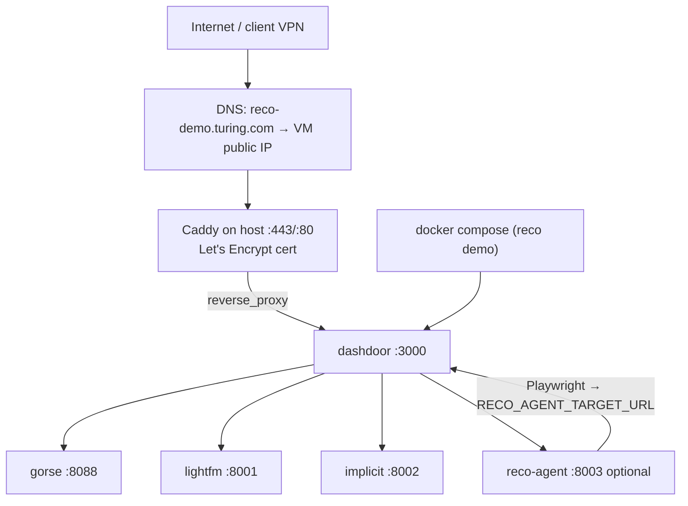

# Deploy plan — reco demo on GCP (`reco-demo.turing.com`)

Target: run the **full reco demo** (real Dashdoor gym + engine sidecars +
optional LLM agent) on a **GCP VM**, reachable at **`https://reco-demo.turing.com`**.

**VM (internal):** `10.128.0.51`  
**Public URL (after DNS + TLS):** `https://reco-demo.turing.com`

This doc is the operator runbook. Product/demo UX is in `demo_setup.md`.

---

## 0. Current state (snapshot 2026-05-22)

The demo is **live at https://reco-demo.turing.com** with a real Let's
Encrypt cert (Caddy on the VM host, `notAfter=2026-08-20`, auto-renews).
Recent changes worth knowing about:

- **`scripts/deploy.sh` builds images locally and ships them.** No more
  `docker compose build` on the VM. Build → `docker save | gzip` →
  `gcloud compute scp` → VM `docker load` → compose up. Single 1.4 GB
  tarball; full deploy wall-clock ≈ 14 min (cache hot), of which scp
  dominates.
- **Caddy + TLS auto-bootstrap.** `deploy.sh` installs Caddy from
  Cloudsmith if absent, writes `/etc/caddy/Caddyfile`, drops in a
  `Restart=on-failure` systemd override so renewal can't stall on a
  crash. Public HTTPS smoke at the end of every deploy.
- **Compose locked to loopback.** dashdoor binds `127.0.0.1:3000`;
  Caddy is the only public surface on `:443`. Temp firewall rule
  `reco-demo-port-3000-temp` deleted.
- **DBs baked into the engine images.** `tools/reco-engines/{lightfm,
  implicit}/Dockerfile` now `COPY data/db/dashdoor.db /data/dashdoor.db`,
  so those containers no longer host-mount `data/db/`. The repo tarball
  still ships compose + Caddyfile + env template + seed script (a few
  KB), but is no longer required for sidecar runtime.
- **scp progress in the log.** Deploy step 4 backgrounds scp and polls
  remote size every 15 s, logging `MB / MB (pct) — MB/s avg`.
- **Reco demo UX.** Landing page (`/`) now shows a black orientation
  strip when `NEXT_PUBLIC_RECO_DEMO=1` with the OVERVIEW.md link and
  a "Skip to /demo" pill. `RecoDemoNavLink` in the consumer header is
  a red pill (was small gray text). Post-auth flow unchanged — users
  still land on `/home`; the `/demo` jump is one click away via the
  banner pill or the header link. Small copy fix on `/reco-eval`:
  section heading "What this is" → "How it works" (avoids echoing
  the "What is this?" link above).
- **Pre-seeded Gorse image.** Replaces the flaky on-VM seed step.
  `scripts/preseed-gorse.sh` spins up a throwaway upstream
  `gorse-in-one` on `127.0.0.1:18088`, runs `scripts/seed-gorse.ts`
  against it (host node, no docker juggling), snapshots
  `/var/lib/gorse/{cache,data}.db` into `deploy/gorse-seed/`, and tears
  down. `deploy/Dockerfile.gorse-seeded` bakes those files into a
  `FROM zhenghaoz/gorse-in-one:latest` image named `reco-demo-gorse`.
  Compose's `gorse` service now `build:`s that image and no longer
  mounts a `gorse-data` host volume — the seed *is* the state. The
  seed snapshot is mtime-cached against `data/db/dashdoor.db`; force
  a refresh with `FORCE_PRESEED=1`. Both `scripts/deploy.sh` and
  `scripts/deploy_local.sh` call `preseed-gorse.sh` before the build
  step; the on-VM/local "seed Gorse" steps are gone.

---

## 1. What “single Docker” means here

The stack is **four runtimes** today:

| Process | Image / base | Port |
|---------|----------------|------|
| Dashdoor (Next.js) | `Dockerfile.prod` | 3000 |
| Gorse | `zhenghaoz/gorse-in-one` | 8087 (UI), 8088 (API) |
| LightFM | `tools/reco-engines/lightfm/Dockerfile` | 8001 |
| Implicit | `tools/reco-engines/implicit/Dockerfile` | 8002 |
| reco-agent (optional) | `tools/reco-agent/Dockerfile` (to add) | 8003 |

A **literal single image** with all of the above is possible (supervisord +
Node + 2× Python + Gorse binary) but **high maintenance**. Recommended **v1**:

> **One deploy unit** = one `docker compose` file on the VM, one systemd
> service, **one TLS front door** (Caddy on the host). Clients see one URL.

Optional **v2** monolith image is noted in §8.

---

## 2. Architecture on the VM



**Do not** expose 8001–8088 publicly; only **443 → Caddy → 3000**. Gorse
dashboard (8087) bind to `127.0.0.1` or SSH tunnel for operators only.

**`10.128.0.51`** is typically a **VPC internal** address. For
`reco-demo.turing.com` and Let's Encrypt you also need:

- A **static external IP** on the VM (or forwarding from a load balancer).
- DNS **A record** `reco-demo.turing.com` → that **public** IP (not the
  internal `10.128.0.51` unless clients are VPN-only — see §4).

### 2.1 Data baked into the image

The three SQLite files in `data/db/` are committed and `COPY`'d into
`Dockerfile.prod`, so a fresh VM starts the demo with the same data
every time — no external DB, no first-run migration, no seed step
beyond Gorse.

| File | Size | What it backs | Used by |
|---|---|---|---|
| `data/db/dashdoor.db` | **35 MB** | consumer catalog + orders + reviews | Dashdoor app, all reco engines |
| `data/db/delivery.db` | 116 KB | dasher/delivery side | `/delivery` only |
| `data/db/merchant.db` | 240 KB | merchant admin (stub) | `/merchant` only |

**Consumer DB (`dashdoor.db`) — what's in it:**

| Table | Rows | Notes |
|---|---:|---|
| `users` | 3,001 | Seeded consumers + the e2e `john.doe@example.com` |
| `restaurants` | 594 | 25 cities across 5 states (CA 286, NY 215, NJ 34, MA 33, IL 26); fields incl. lat/lng, cuisine, hours, DashPass flag |
| `categories` / `restaurant_categories` | 58 / 4,481 | 64 distinct cuisine tags; top: chicken (386), healthy (315), DashPass Exclusives (249), asian (231), fast-food (224) |
| `menu_items` | 10,178 | avg 17.1 per restaurant (range 6–38) |
| `menu_categories` | 2,940 | per-restaurant menu sections |
| `orders` | **67,514** | 7-month range 2025-06-03 → 2026-01-14; 96 % `delivered` (64,859), rest `cancelled`/`pending`/`preparing`/etc. |
| `order_items` | 118,765 | |
| `user_reviews` | 63,730 | 1–5 star + content + timestamp |
| `favorite_restaurants` | 7,067 | |
| `addresses` | 3,280 | |
| `promotionals` / `deals` | 5 / 116 | banners + storefront discounts |
| `carts` / `cart_items` | 733 / 1,011 | active sessions |

**Reco signal density:** 3,000 users × 594 restaurants → **64,220
distinct `(user, restaurant)` pairs** from orders (avg **22.5
orders/user**, min 4, max 90; matrix density ≈ 3.6 %). That's the
matrix Gorse / LightFM / Implicit train against; the scoreboard's
history-split eval (see `how_to_use.md` Mode 1) leave-one-out on this
set.

#### What each engine actually consumes

Same DB, very different slices. **Reviews, favorites, cart contents,
and addresses are not fed to any CF engine today** — only the
`orders → (user, store)` signal. Reviews are used only by the
`popularity` baseline (for the rating score).

| Engine | Inputs | Notes |
|---|---|---|
| `random` | restaurant list + distance | sanity floor |
| `popularity` | `restaurants` + approved `user_reviews` + `featured`/`new_flag` + lat/lng | score = `avg_rating × log(1 + review_count)`, biased by `featured`/`new_flag`; same formula as the live `/home` feed |
| `gorse` | `users` + `restaurants` + `orders` (`FeedbackType="star"`) | seeded by `scripts/seed-gorse.ts`; CF-only mode (BPR matrix factorization + cosine neighbors + popularity fallback) |
| `lightfm` | orders matrix + item features (cuisine, price tier, DashPass flag, category tags) | WARP loss, 30 epochs, 32 components; **hybrid** — falls back to content for cold-start items |
| `implicit` | orders matrix only | ALS (default) or BPR; 64 factors × 15 iterations; pure CF |
| `agent` | live UI traversal (no DB access) | LLM drives Playwright on the real `/home` — its top-1 click is the recommendation |

The two Python sidecars share `tools/reco-engines/common/db.py`, which:
1. Loads all `restaurants` → item index (594 items).
2. Loads all `users` → user index (3,001 users).
3. Builds a binary CSR matrix from `orders WHERE store_id IS NOT NULL`
   (duplicate (user, store) pairs collapsed to 1).
4. Builds item content features from `cuisine`, `price_range` (→
   `price:$`, `price:$$`, …), `dash_pass`, and category-tag joins
   from `restaurant_categories` (LightFM only).
5. Exposes per-item lat/lng for the 10-mile distance filter applied
   at serve time across every engine.

**Cold-start handling.** Users with zero orders fall through to
`popularity`'s formula across all CF engines (Gorse explicit fallback,
LightFM/Implicit via the `popularity` array in the shared catalog).
LightFM additionally personalizes cold-start *items* by content
features.

**Coverage caveat.** Because every engine applies the 10-mile distance
filter using `ctx.lat`/`ctx.lng`, results vary by user location even
if the underlying matrix doesn't change. Eval tasks ship their own
`userLat`/`userLng` so engines are scored on the same candidate pool.

**Delivery DB** (116 KB): 5 partners, 105 orders, 69 ratings, 10
earnings rows, 8 payout methods — sized for the `/delivery` UI flows,
not for analytics.

**Merchant DB** (240 KB): 3 merchants / 5 stores / 10 menu items / 6
orders / 5 reviews — intentionally tiny; merchant app is a stub.

**Task set (`data/reco-tasks/seed.json`, 4 KB):** 10 hand-curated
natural-language reco tasks (the "seed" task set in the eval UI). Each
row: `taskId`, `statement` (e.g. *"Order mac & cheese from West Diner,
select the extra cheese add on"*), `surface` (`home_feed`), `user`
email, `userLat`/`userLng`, `expectedKind` (`restaurant`),
`expectedItemIds`, `expectedNames`. The agent track and the engine
track score against this same file.

**Gorse runtime data** lives in the named volume `gorse-data` (cache +
data SQLite under `/var/lib/gorse/` inside the container). After
`scripts/deploy-seed-gorse.sh` runs, it holds roughly:
- 3,000 users
- 594 items
- ~64,220 implicit-feedback events ("order" type)

Backups: the only stateful volume on the VM is `gorse-data` (and the
swapfile, which is throwaway). If you `docker compose down -v` you
lose the Gorse training state and must re-seed; the SQLite source data
inside the image is unaffected.

---

## 3. GCP prerequisites

| Item | Action |
|------|--------|
| VM | e2-standard-4 (or e2-standard-2 minimum), Ubuntu 22.04/24.04, disk ≥ 40 GB |
| Internal IP | `10.128.0.51` (existing or assign in subnet) |
| External IP | Reserve static regional IP; attach to VM |
| Firewall | Ingress TCP **80, 443** from `0.0.0.0/0` (or corp IP range); **deny** 3000, 8001–8088 from internet |
| DNS | After registration: **A** `reco-demo.turing.com` → static external IP; optional **AAAA** if IPv6 |
| SSH | Your team key → VM; deploy user e.g. `reco-demo` in group `docker` |
| Egress | Allow HTTPS outbound (LLM APIs, Let's Encrypt, image pulls) |

**VPN-only demo:** If the site must not be public, skip public DNS/LE; use
internal CA or self-signed cert and point `reco-demo.turing.com` via split DNS
to `10.128.0.51`. §6 assumes **public** HTTP-01 or DNS-01 for Let's Encrypt.

---

## 4. DNS checklist (when domain is registered)

1. Create zone or record in your DNS provider (e.g. Cloud DNS for `turing.com`).
2. **A record:** `reco-demo` → `<VM_STATIC_EXTERNAL_IP>` (TTL 300–3600).
3. Wait for propagation: `dig +short reco-demo.turing.com`.
4. Only then run Caddy / certbot (§6) — LE will fail if DNS does not point here.

---

## 5. Repo deliverables

| Artifact | Purpose |
|----------|---------|
| `config/docker-compose.demo.yaml` | Demo stack: dashdoor + gorse + lightfm + implicit + reco-agent |
| `deploy/caddy/Caddyfile` | TLS reverse proxy for `reco-demo.turing.com` |
| `deploy/env.demo.example` | Template → copy to `/etc/reco-demo/env` on VM |
| `deploy/systemd/reco-demo.service` | Boot-time compose |
| `deploy/Dockerfile.gorse-seed` | One-shot seed container |
| `scripts/demo-up.sh` / `scripts/demo-down.sh` | Start/stop stack |
| `scripts/deploy-seed-gorse.sh` | Idempotent Gorse seed |
| `tools/reco-agent/Dockerfile` | Agent sidecar (Playwright + Hono) |
| `app/demo/page.tsx` + `components/reco-demo-nav-link.tsx` | Landing + link from `/home` |
| `.github/workflows/deploy-reco-demo-gcp.yml` | Optional — not added yet |

**Dashdoor image build** (already exists):

```bash
docker build -f Dockerfile.prod \
  --build-arg RECO_DEMO=1 \
  -t reco-demo-dashdoor:latest .
```

**Compose on VM** (not a single image, but one command):

```bash
ENV_FILE=/etc/reco-demo/env ./scripts/demo-up.sh
# or: docker compose -f config/docker-compose.demo.yaml up -d --build
# (reco-agent reads ENV_FILE via compose env_file interpolation)
```

---

## 5.1 Port binding (current state)

**End state (default in repo as of 2026-05-22):** dashdoor binds to
`127.0.0.1:3000` only. Caddy on the VM host terminates TLS on `:443`
and reverse-proxies to that loopback port. `scripts/deploy.sh`
installs and configures Caddy automatically — there is no longer a
"flip port mapping after TLS" manual step.

```yaml
# config/docker-compose.demo.yaml
dashdoor:
  ports:
    - "127.0.0.1:3000:3000"
```

Sidecars (`gorse 8087/8088`, `lightfm 8001`, `implicit 8002`,
`reco-agent 8003`) stay on `127.0.0.1` inside the compose network too.
The agent reaches dashdoor over compose DNS (`http://dashdoor:3000`),
which is independent of the host port binding.

### Transitional fallback (only if you need pre-DNS plain-HTTP access)

If you ever need to demo over the external IP **before** DNS is in
place, temporarily edit compose to `"3000:3000"` and open a firewall:

```bash
gcloud compute instances add-tags rb-reco-engine-eval \
  --zone us-central1-c --project turing-delivery-rl-gym \
  --tags=reco-demo

gcloud compute firewall-rules create reco-demo-port-3000-temp \
  --project=turing-delivery-rl-gym \
  --direction=INGRESS --action=ALLOW --rules=tcp:3000 \
  --source-ranges=0.0.0.0/0 --target-tags=reco-demo
```

After TLS comes up, revert the compose port and delete the firewall
rule. `scripts/deploy.sh` prints the delete command at the end of every
run as a reminder.

---

## 6. TLS certificate for `reco-demo.turing.com`

**Caddy on the VM host** terminates TLS via Let's Encrypt. As of
2026-05-22 this is fully automated by `scripts/deploy.sh` step 5 — no
manual Caddy install / Caddyfile copy / cert request is needed.

### 6.1 What deploy.sh does

1. `apt-get install caddy` from the official Cloudsmith repo (idempotent;
   skipped if `caddy` is already on `$PATH`).
2. Copies `deploy/caddy/Caddyfile` → `/etc/caddy/Caddyfile`.
3. Runs `caddy validate` before reloading so a bad Caddyfile can't take
   the running site down.
4. `systemctl enable --now caddy` and `systemctl reload caddy`.
5. After the compose stack is up, polls `https://reco-demo.turing.com/demo`
   for up to 90 s — Caddy obtains the LE cert lazily on the first
   handshake, so the first poll often takes a few seconds.

### 6.2 Caddyfile (committed)

`deploy/caddy/Caddyfile`:

```caddy
reco-demo.turing.com {
    reverse_proxy 127.0.0.1:3000
}
```

To customize, edit that file in the repo and re-run `scripts/deploy.sh` —
the script copies it into `/etc/caddy/Caddyfile` and reloads Caddy.

### 6.3 Automatic cert renewal

Caddy renews the Let's Encrypt cert on its own — no external cron,
certbot timer, or manual rotation. Mechanics:

- **When:** Caddy checks every ~30 min and renews when remaining
  lifetime drops below 1/3 of total (≈ 30 days before expiry for a
  90-day LE cert). The cert issued on 2026-05-22 expires
  **2026-08-20**, so renewal will fire around **2026-07-21**.
- **Where state lives:** `/var/lib/caddy/.local/share/caddy/` —
  ACME account + cert + private key are persisted, so reboots and
  `apt upgrade caddy` don't trigger a re-issuance.
- **HTTP-01 challenge:** Caddy itself listens on `:80` to answer the
  challenge. The deploy-time firewall must keep `:80` open (it
  already is — `allow-http` rule, all VMs).
- **Restart resilience:** `deploy.sh` installs a systemd drop-in
  (`/etc/systemd/system/caddy.service.d/restart.conf`) so the upstream
  unit auto-restarts on crash (`Restart=on-failure`, `RestartSec=5s`).
  Without this, a Caddy crash would also stall the renewal goroutine.

#### Spot-check renewal health

```bash
# On the VM:
sudo systemctl status caddy --no-pager | head
sudo journalctl -u caddy --since '24 hours ago' | grep -iE 'renew|certificate|acme'
sudo cat /var/lib/caddy/.local/share/caddy/certificates/acme-v02.api.letsencrypt.org-directory/reco-demo.turing.com/reco-demo.turing.com.crt \
  | openssl x509 -noout -dates
```

If `notAfter` is < 25 days away and Caddy logs show no renewal
attempts, force one with `sudo systemctl restart caddy` (Caddy
revalidates on boot) or remove the cached cert files and restart.

### 6.4 If TLS smoke fails

```bash
sudo journalctl -u caddy -n 200 --no-pager       # cert/HTTP-01 issues
sudo systemctl status caddy
dig +short reco-demo.turing.com                  # must be VM external IP
gcloud compute firewall-rules list --filter='name~http OR name~https'
```

Common causes:
- DNS hasn't propagated to this host yet (LE HTTP-01 fails).
- Port 80 or 443 not reachable (firewall / external IP not attached).
- The wrong external IP is attached to the VM.

### 6.5 Alternative: certbot + nginx

Not used. If you ever need it:

```bash
sudo apt install nginx certbot python3-certbot-nginx
# nginx site proxy_pass http://127.0.0.1:3000;
sudo certbot --nginx -d reco-demo.turing.com
```

### 6.6 Before DNS exists

- SSH tunnel: `ssh -L 3000:127.0.0.1:3000 user@<VM>`
- Or use the §5.1 transitional fallback to expose `:3000` directly.
- **Do not** commit private keys or real certs to the repo.

---

## 7. VM setup (first time)

Assume Debian 12 (Bookworm) or Ubuntu 22.04+. Steps 1–8 below are
automated by **`scripts/deploy.sh`** (one-shot, idempotent). For the
manual breakdown, see §7.2.

### 7.1 One-shot deploy from the laptop (recommended)

```bash
# from the repo root on your laptop
./scripts/deploy.sh
```

That's the whole interface. `scripts/deploy.sh` runs entirely on the
laptop and does, idempotently:

1. **Build** all images locally for `linux/amd64` via
   `DOCKER_DEFAULT_PLATFORM=linux/amd64 docker compose --profile seed build`.
2. **`docker save`** the four runtime images + `gorse-seed` into a
   single `/tmp/reco-demo-images.tar.gz`.
3. **Tar the repo** (compose file, Caddyfile, env template, scripts,
   committed SQLite DBs) into `/tmp/reco-demo.tar.gz`.
4. **`gcloud compute scp`** both tarballs to the VM in one call.
5. **`gcloud compute ssh ... bash -s`** with a heredoc that, on the VM,
   extracts the repo to `/opt/reco-demo`, writes
   `/etc/reco-demo/env` (mode 600) and injects `ANTHROPIC_API_KEY` /
   `OPENAI_API_KEY` (read from the laptop's `./.env`), installs Caddy
   if needed and writes `/etc/caddy/Caddyfile`, then
   `docker load < /tmp/reco-demo-images.tar.gz`, `docker compose up
   -d` (no build), `scripts/deploy-seed-gorse.sh`, and an HTTPS smoke
   loop against `${PUBLIC_HOST}`.

Override defaults with env vars: `VM`, `ZONE`, `PROJECT`, `PUBLIC_HOST`.

**Prerequisites on the VM:** Docker Engine + Compose v2 (`get.docker.com`
works; we run Docker 29 / Compose v5). Everything else `deploy.sh` handles.

**Why build-local-then-ship.** The VM is a 4 vCPU / 3.8 GB-RAM box.
Building the Python sidecars there used to take 7+ min and held a 4 GB
swapfile under pressure; cross-builds from the laptop run while the VM
keeps serving HTTPS, and the resulting `docker load` is ~5–10 s once
the tarball lands.

**First-run cost on Apple Silicon:** ~20–40 min for the initial
amd64 cross-build of the Python stack (numpy/scipy/lightfm/implicit
under QEMU). Subsequent runs reuse buildx layer cache.

Re-running is safe: Caddy install is skipped if already present;
existing env-file keys are updated in place; swap is left alone;
loaded images replace old layers in the daemon.

### 7.1.5 Run the stack locally (for testing before redeploy)

Same `config/docker-compose.demo.yaml`, same images, just point at a
local env file:

```bash
# from the repo root on your laptop
cp deploy/env.demo.local.example deploy/env.demo.local
# edit deploy/env.demo.local — fill in ANTHROPIC_API_KEY and/or OPENAI_API_KEY

# bring everything up locally
ENV_FILE=deploy/env.demo.local ./scripts/demo-up.sh

# wait for healthchecks, then seed Gorse
docker compose -f config/docker-compose.demo.yaml --env-file deploy/env.demo.local \
  --profile seed run --rm gorse-seed
```

Then hit `http://localhost:3000/demo`, `/reco-eval`, `/home` directly
from your browser. `deploy/env.demo.local` is gitignored — real keys
stay on your laptop. Tear down with
`docker compose -f config/docker-compose.demo.yaml down`.

Use this loop to smoke-test compose-file or sidecar changes before
SCPing them to the VM via `scripts/deploy.sh`.

---

### 7.2 Manual breakdown (only if you need to debug a step)

```bash
# Operator access
gcloud compute ssh --zone us-central1-c rb-reco-engine-eval \
  --project turing-delivery-rl-gym

# On the VM:
sudo mkdir -p /opt/reco-demo && sudo chown $USER:$USER /opt/reco-demo
tar -xzf /tmp/reco-demo.tar.gz -C /opt/reco-demo
sudo mkdir -p /etc/reco-demo && sudo chmod 700 /etc/reco-demo
sudo cp /opt/reco-demo/deploy/env.demo.example /etc/reco-demo/env
sudo chmod 600 /etc/reco-demo/env
sudo nano /etc/reco-demo/env   # ANTHROPIC_API_KEY, OPENAI_API_KEY

cd /opt/reco-demo
docker compose -f config/docker-compose.demo.yaml --env-file /etc/reco-demo/env build
docker compose -f config/docker-compose.demo.yaml --env-file /etc/reco-demo/env up -d
./scripts/deploy-seed-gorse.sh

# Smoke
curl -sS http://127.0.0.1:3000/api/reco/engines | head
curl -sS -o /dev/null -w "%{http_code}\n" http://127.0.0.1:3000/demo
curl -sS -o /dev/null -w "%{http_code}\n" http://127.0.0.1:3000/reco-eval

# Caddy + DNS (after reco-demo.turing.com → external IP)
sudo systemctl enable --now caddy
curl -sS -o /dev/null -w "%{http_code}\n" https://reco-demo.turing.com/demo
```

### 7.1 Environment template (`/etc/reco-demo/env`)

```bash
# Dashdoor
RECO_DEMO=1
NODE_ENV=production
LIBSQL_URL=file:/app/dashdoor.db
DELIVERY_LIBSQL_URL=file:/app/delivery.db
MERCHANT_LIBSQL_URL=file:/app/merchant.db
PREFIX_URL=https://meta-ui-images.s3.us-west-2.amazonaws.com/

# Engine sidecars (compose service names)
RECO_GORSE_URL=http://gorse:8088
RECO_LIGHTFM_URL=http://lightfm:8001/recommend
RECO_IMPLICIT_URL=http://implicit:8002/recommend

# Agent (optional — client keys)
RECO_AGENT_URL=http://reco-agent:8003/recommend
RECO_AGENT_TARGET_URL=http://dashdoor:3000
ANTHROPIC_API_KEY=
OPENAI_API_KEY=
RECO_AGENT_MODEL=claude-sonnet-4-6
RECO_AGENT_MAX_STEPS=25
RECO_AGENT_HEADLESS=1
RECO_AGENT_TIMEOUT_MS=120000
```

Compose must map **only** `127.0.0.1:3000:3000` for dashdoor so the app is
not reachable without Caddy.

---

## 8. Optional: true single image (v2)

If you must ship **one** `docker pull` for air-gapped clients:

1. Base image: `node:20-bookworm` + `python3.11` + supervisord.
2. Copy Next standalone artifact + both Python apps + download Gorse binary
   or run Gorse as separate minimal stage.
3. `supervisord.conf` starts: gorse, uvicorn×2, node server.js, reco-agent.
4. Single `EXPOSE 3000`; sidecars on `127.0.0.1` only inside the network namespace.

**Cost:** large image (~2–4 GB), slower builds, harder debugging. **Defer** until
compose deploy is stable on `10.128.0.51`.

---

## 9. Image build & registry (GCP Artifact Registry)

```bash
# One-time: enable Artifact Registry, create repo reco-demo

export REGION=us-central1
export PROJECT_ID=your-gcp-project
export REGISTRY=$REGION-docker.pkg.dev/$PROJECT_ID/reco-demo

docker build -f Dockerfile.prod --build-arg RECO_DEMO=1 \
  -t $REGISTRY/dashdoor:latest .
docker push $REGISTRY/dashdoor:latest

# Same for lightfm, implicit, reco-agent Dockerfiles
```

On VM: `docker pull` instead of local build; compose file uses full image refs.

**Without registry:** `docker save` on CI machine, `scp` to VM, `docker load`.

---

## 10. systemd (auto-start)

`/etc/systemd/system/reco-demo.service`:

```ini
[Unit]
Description=Reco demo docker compose
After=docker.service network-online.target
Requires=docker.service

[Service]
Type=oneshot
RemainAfterExit=yes
WorkingDirectory=/opt/reco-demo
EnvironmentFile=/etc/reco-demo/env
ExecStart=/usr/bin/docker compose -f config/docker-compose.demo.yaml up -d --remove-orphans
ExecStop=/usr/bin/docker compose -f config/docker-compose.demo.yaml down
TimeoutStartSec=600

[Install]
WantedBy=multi-user.target
```

```bash
sudo systemctl daemon-reload
sudo systemctl enable reco-demo
sudo systemctl start reco-demo
```

---

## 11. Post-deploy verification

| Check | Command / URL |
|-------|----------------|
| TLS | `https://reco-demo.turing.com` — valid cert, no browser warning |
| Landing | `https://reco-demo.turing.com/demo` |
| Eval UI | `https://reco-demo.turing.com/reco-eval` |
| Engines API | `curl https://reco-demo.turing.com/api/reco/engines` |
| Home + link | `/home` shows “Recommendation engine demo” when demo flag on |
| History eval | Run from UI or `POST /api/reco/eval` (see `HOW_TO_TEST.md`) |
| Agent | With keys set, engine `agent` appears; one stub run `model: stub` |
| Gorse seed | `curl http://127.0.0.1:8088/api/user/1` via SSH tunnel |

---

## 12. Updates & rollback

```bash
cd /opt/reco-demo
git pull   # or deploy new image tags
docker compose -f config/docker-compose.demo.yaml --env-file /etc/reco-demo/env build
docker compose -f config/docker-compose.demo.yaml --env-file /etc/reco-demo/env up -d
./scripts/deploy-seed-gorse.sh   # safe if idempotent
```

Rollback: pin previous image tag in compose or `git checkout <tag>` and `up -d`.

**Data:** Gorse volume `gorse-data` persists; document backup of
`/var/lib/docker/volumes/` if demos matter.

---

## 13. Security notes

- LLM API keys only in `/etc/reco-demo/env` (mode `600`, root-owned).
- Do not expose Gorse dashboard or Python sidecars on `0.0.0.0`.
- Rate-limit or auth on `/api/reco/eval` if the host is public (future; see
  `RECO_PLAN.md` §5.4).
- Keep `RECO_DEMO=0` images for non-demo production if you fork deploy paths.

---

## 14. Implementation order (engineering)

1. [x] `config/docker-compose.demo.yaml`, `tools/reco-agent/Dockerfile`, deploy assets, scripts.
2. [x] `/demo` landing + home header link.
3. [x] Provision GCP VM (`10.128.0.51`, public `34.134.213.241`) + firewall 80/443.
       - VM tags (confirmed 2026-05-22): `https-server`, `monitoring`, `reco-demo`.
       - 80 open via `allow-http` / `allow-http-all` (all VMs).
       - 443 open via `default-allow-https` (target `https-server`).
4. [x] DNS `reco-demo.turing.com` → `34.134.213.241` (verified
       `dig +short reco-demo.turing.com` on 2026-05-22).
5. [x] `scripts/deploy.sh` extended to install + configure Caddy
       automatically (Cloudsmith repo install, drop Caddyfile,
       `caddy validate`, `systemctl enable --now caddy`, public HTTPS
       smoke against `${PUBLIC_HOST:-reco-demo.turing.com}`).
6. [x] Lock dashdoor host port back to `127.0.0.1:3000` in
       `config/docker-compose.demo.yaml`.
7. [x] First end-to-end deploy run on 2026-05-22: build 415 s on VM,
       compose up, Caddy installed + LE cert issued
       (`notAfter=2026-08-20`), HTTPS smoke 200 on `/demo`,
       `/reco-eval`, `/home`, `/api/reco/engines`.
8. [x] Smoke `https://reco-demo.turing.com/demo` and `/reco-eval` from
       the laptop — 200 OK, real LE cert, HTTP/2 via Caddy.
9. [x] Deleted temp firewall rule `reco-demo-port-3000-temp`. Port 3000
       is no longer reachable from the internet
       (`curl http://34.134.213.241:3000` times out).
10. [x] Caddy systemd drop-in installed for `Restart=on-failure` /
       `RestartSec=5s` (auto-renewal-safe across crashes). Verified
       on VM 2026-05-22.
11. [ ] **Refactor `deploy.sh` to build-local-then-ship** (no more
       building on the VM; `docker save | scp | docker load`).
12. [ ] (Optional) install `deploy/systemd/reco-demo.service` so the
       stack restarts on VM boot. Compose has `restart: unless-stopped`
       on each container, so this is only needed if you want compose
       itself rebuilt/recreated on boot.
13. [x] **Pre-seeded Gorse image.** `scripts/preseed-gorse.sh` +
       `deploy/Dockerfile.gorse-seeded` + compose change land it.
       Both `scripts/deploy.sh` and `scripts/deploy_local.sh` call the
       preseed before building; the on-VM/local seed steps are gone.
       Snapshot is mtime-cached against `data/db/dashdoor.db`
       (override with `FORCE_PRESEED=1`).

---

## 15. Related docs

- `demo_setup.md` — client self-serve, BYO LLM, `/demo` landing plan
- `HOW_TO_TEST.md` — functional smoke tests
- `GORSE_VERIFY.md` — Gorse seed and eval bar
- `config/docker-compose.reco.yaml` — current multi-service reference
- `Dockerfile.prod` — Dashdoor production image
