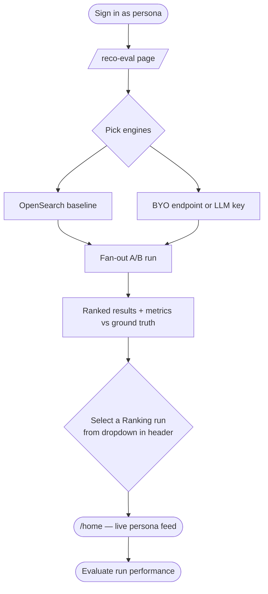

# Dashdoor Reco Lab — Client Demo Guide

> **The pitch in one sentence:** Sign in as a real consumer persona, run your ranking model against OpenSearch in a live A/B eval, and watch your model's output reorder the home feed in real time — so you can see exactly what your customers would experience, not just a metric table.

---

## How it works



---

## Step 1 — See the baseline (no setup needed)

Everything below works out of the box against **OpenSearch**, which is always running as the named baseline.

### Test logins

All passwords are `password`.

| Persona | Email | Vibe | Top cuisines |
|---|---|---|---|
| Alice Tran | `alice.tran@example.com` | Explorer (novelty 0.7), mid-price | Thai · Vietnamese · Japanese |
| Eli Nakamura | `eli.nakamura@example.com` | Max explorer (novelty 0.9), premium | Japanese · Korean · Chinese |
| Chloe Okafor | `chloe.okafor@example.com` | Balanced (novelty 0.5), budget | Indian · Mediterranean · Mexican |
| Gabe Jensen | `gabe.jensen@example.com` | Homebody (novelty 0.2), mid-price | American · Italian · Mexican |
| **John Doe** | `john.doe@example.com` | Non-persona control — standard feed, no runs | — |

### Walkthrough

1. **Open `/reco-eval`** — no login required. The OpenSearch engine is pinned as the baseline (can't be unchecked).
2. **Pick a persona** from the dropdown — start with **Alice Tran**.
3. Click **Run**. Within a few seconds you get a ranked table of restaurants with metrics scored against the ground-truth rule (precision, recall, NDCG).
4. The run is automatically saved. The **header dropdown** (next to the red Reco Eval pill) now lists it — select it from any page to activate.
5. **Sign in** as `alice.tran@example.com` / `password` and open `/home`.
6. Select Alice's run from the header dropdown. You'll see her cuisine sections (Thai, Vietnamese, Japanese) reordered by OpenSearch, with a light-blue banner confirming which run is active.
7. Select "— Rule default —" to return to the standard rule-ordered feed.
8. Sign in as `john.doe@example.com` — he has no runs, so the dropdown shows only "— Rule default —" and his feed is the standard unmodified DoorDash home page.

---

## Step 2 — Bring your own ranking model

This is where it gets interesting. You can plug in your model two ways:

### Path A — Your own `/recommend` endpoint

You host a service that accepts a candidate set + feature vectors and returns a ranked list. No changes to the gym needed.

1. On `/reco-eval`, expand the **BYO panel** and select the **"Use my endpoint"** tab.
2. Enter your URL, e.g. `https://my-ranker.internal/recommend`.
3. Click **Run** — the gym sends the same candidate pool OpenSearch saw (radius-filtered restaurants + per-candidate features: cuisine-affinity match, price-tier match, distance, avg rating, past-order count, promo flag).
4. The A/B table shows your model's metrics side-by-side with OpenSearch. Columns in **bold** beat the baseline; red means it loses.

**Request shape your endpoint receives:**
```json
{
  "personaId": "alice-tran",
  "topK": 20,
  "candidates": [
    {
      "id": 42,
      "features": {
        "cuisine_affinity_score": 0.9,
        "price_tier_match": true,
        "distance_miles": 1.2,
        "avg_rating": 4.3,
        "persona_order_count": 5,
        "has_promo": false
      }
    }
  ]
}
```

**Expected response:**
```json
{
  "ranked_ids": [42, 17, 88, ...],
  "scores": { "42": 0.93, "17": 0.81 },
  "trajectory": { "engine": "my-ranker", "steps": [...] }
}
```

See `docs/reco-http-contract.md` for the full contract.

---

### Path B — Your own LLM key

Don't have a ranker endpoint yet? Point us at your LLM and we run the ranking prompt through it.

1. On `/reco-eval`, expand the **BYO panel** and select the **"Use my LLM"** tab.
2. Enter your **base URL** (default: `https://api.openai.com/v1`), **API key**, and **model name** (e.g. `gpt-4o-mini`, `gpt-4o`, your fine-tuned model slug).
3. Click **Run** — the gym formats the candidate list as a ranking prompt, calls your model, and parses the response back into `ranked_ids`.
4. Your key is **never stored** — it lives only for the duration of that request.

**A/B across models:** run once with `gpt-4o-mini`, then again with `gpt-4o`. Both runs are saved. Use the header dropdown to flip between them on `/home` and *see* the ordering difference, not just read the metric delta.

---

## What the ground truth is (and why it matters)

The gym ships with a **rule-derived ground truth** for each persona — a pure function of their preference profile, order history, and review history. It drives:

- The **expected** column in the A/B metric table (your model is scored against this).
- The **cuisine section scaffolding** on `/home` — which cuisines appear, how many familiar vs. explore slots each gets (driven by the persona's `novelty_appetite`).

Key things the rule does:

| Rule | Example |
|---|---|
| Hot cuisines from `affinity × order_count` | Alice ordered Thai 5× with 0.9 affinity → Thai section always appears |
| Explore/familiar split by novelty appetite | Eli (0.9) sees 3 "Try something new" cards; Gabe (0.2) sees 1 |
| Block restaurants with ≤ 2★ reviews | If Alice rated a place 1★, it never shows in her sections |
| Cuisine adjacency for explore slots | Thai explore slot prefers Vietnamese / Malaysian before random picks |
| Outlier cleaning | A one-off catering order doesn't inflate that cuisine's weight |

Your model is graded on how well its `ranked_ids` agree with this rule — precision@k, recall@k, NDCG@k, and a penalty for surfacing any blocked restaurant.

---

## Quick reference

| URL | What it is |
|---|---|
| `/reco-eval` | A/B eval page — run engines, see metrics, apply to feed |
| `/home` | Consumer home feed — persona sections + active run banner |
| `GET /api/reco/runs` | All saved runs (JSON) |
| `GET /api/reco/runs?id=…` | Single run |
| `DELETE /api/reco/runs` | Clear all runs |

---

## Persona cheat sheet

| Name | Email | Novelty | Price | Top cuisines |
|---|---|---|---|---|
| Alice Tran | `alice.tran@example.com` | 0.7 | mid | Thai, Vietnamese, Japanese |
| Ben Kowalski | `ben.kowalski@example.com` | 0.2 | premium | Italian, Mediterranean, American |
| Chloe Okafor | `chloe.okafor@example.com` | 0.5 | budget | Indian, Mediterranean, Mexican |
| Diego Mendoza | `diego.mendoza@example.com` | 0.3 | mid | Mexican, American |
| Eli Nakamura | `eli.nakamura@example.com` | 0.9 | premium | Japanese, Korean, Chinese |
| Fatima Rashid | `fatima.rashid@example.com` | 0.4 | mid | Mediterranean, Mexican, American |
| Gabe Jensen | `gabe.jensen@example.com` | 0.3 | mid | American, Italian, Mexican |
| Hana Park | `hana.park@example.com` | 0.5 | mid | Korean, Chinese, Japanese |
| Idris Mensah | `idris.mensah@example.com` | 0.2 | budget | Chinese, American, Italian |
| Julia Volkov | `julia.volkov@example.com` | 0.6 | premium | Vietnamese, Thai, Chinese |
| **John Doe** (control) | `john.doe@example.com` | — | — | Standard feed, no persona sections |

All passwords: `password`
