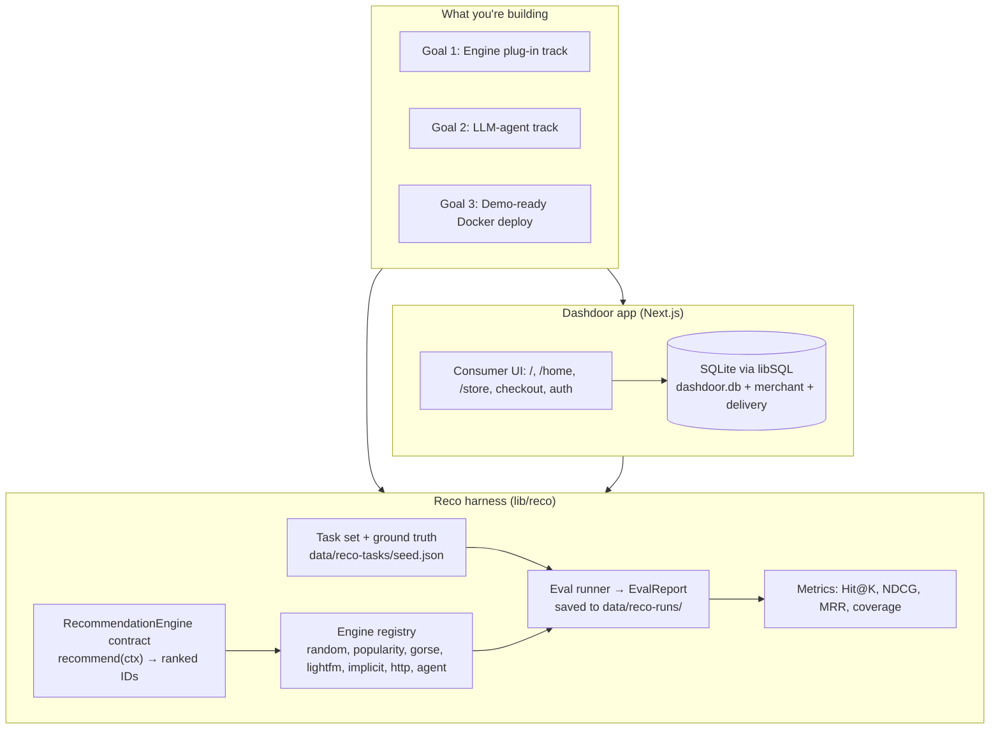
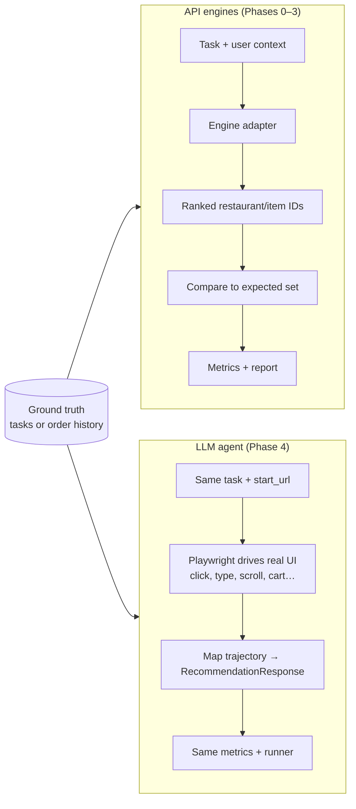
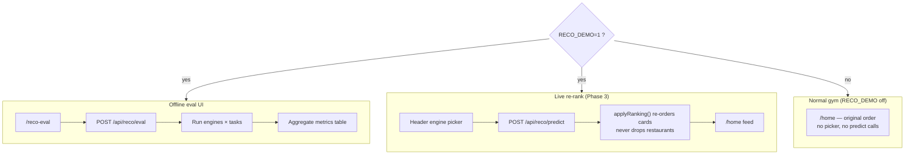
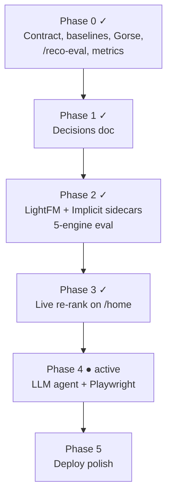
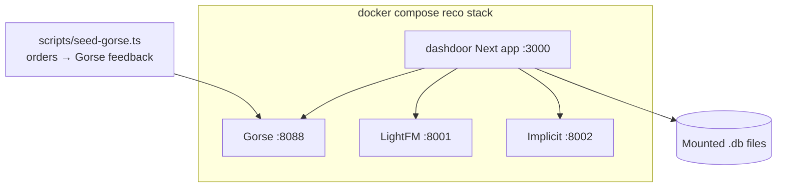

# Overview — what this project does

Dashdoor is a DoorDash-style **RL/UI gym**. This repo extends it into a
**recommendation-engine evaluation harness**: plug in engines (or an LLM that
drives the UI), run the same tasks against the same ground truth, and compare
metrics. With `RECO_DEMO=1`, you can also **re-sort the live `/home` feed**
from a header picker.

---

## System overview

---

## Two ways recommendations get scored

---

## Where it shows up in the app

---

## Phased delivery

Phase checklists: `RECO_PLAN.md` (all phases), `EXECUTION.md` (current phase
only). Archived step lists live under `docs/execution-phase-*.md`.

---

## Docker / reco stack (optional local run)

---

## Related docs

| Doc | Use for |
|-----|---------|
| `RECO_PLAN.md` | Phased goals, exit criteria, checkboxes |
| `EXECUTION.md` | Step-by-step work for the **current** phase |
| `HOW_TO_TEST.md` | Running evals and smoke tests |
| `docs/reco-http-contract.md` | External engine HTTP API |
| `gorse_work.md` | Gorse-specific verification and tuning |
